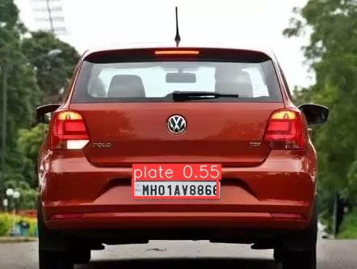

# Streamlit based Automatic Number Plate Recognition

Navigate to the root directory of this repository and simply run the command: 
```
streamlit run app.py
```
Navigate to http://localhost:8501 in your web-browser.


------------
## Results 
------------

| **Output Images**  | **Output Images**  |
|---------------------|-----------------------|
|   |   |
|   |   |
|   |   |
